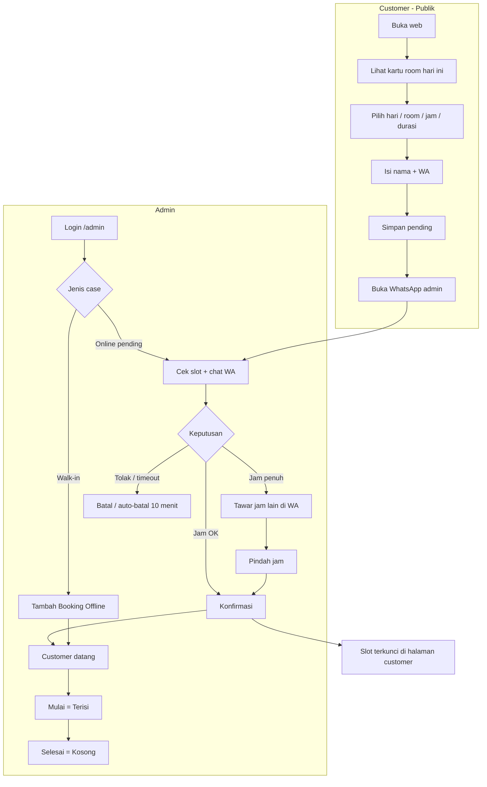
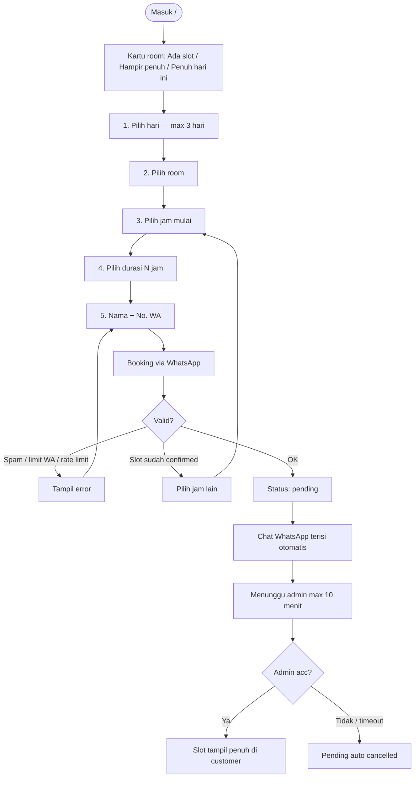
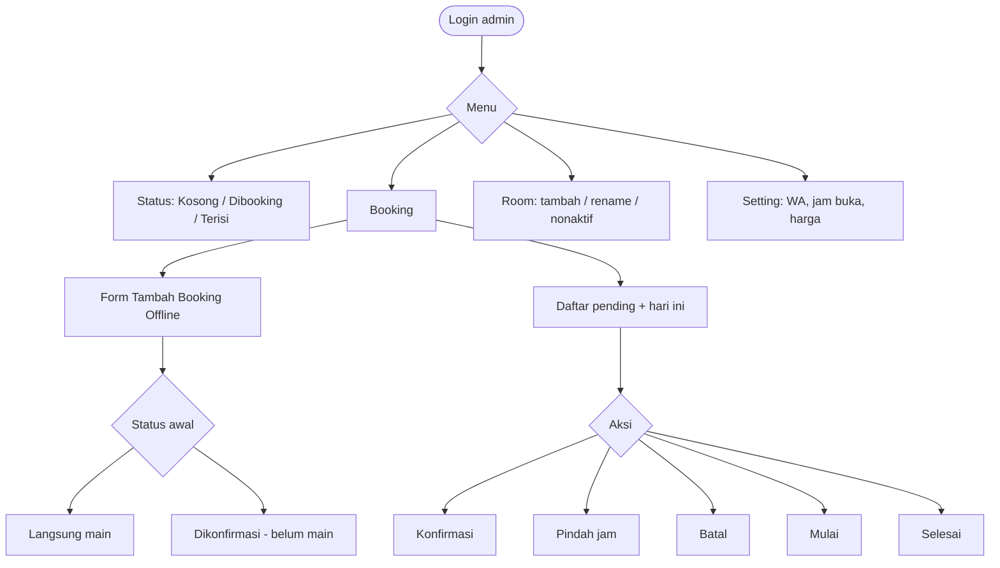

# Serah Terima — Web Booking Rental PS

Dokumen ini untuk penyerahan sistem ke pemilik / operator / developer lain.

---

## 1. Ringkasan produk

Web booking rental PlayStation dengan 2 sisi:

| Sisi | URL | Fungsi |
|------|-----|--------|
| **Customer** | `/` | Lihat ketersediaan, booking online → WhatsApp |
| **Admin** | `/admin` | Pantau room, konfirmasi, booking offline, kelola room & setting |

**Stack:** Next.js + TypeScript + Tailwind + Prisma + **Neon Postgres** + NextAuth

---

## 2. Cara menjalankan & menutup

### Development (lokal)

```powershell
cd "c:\Users\kadek\project web rental ps"
npm install
npx prisma migrate dev
npx prisma db seed
npm run dev
```

Buka: http://localhost:3000 (atau port lain yang tertulis di terminal)

**Menutup:** di terminal tekan `Ctrl + C`

### Production (ringkas)

```powershell
npm run build
npm start
```

### Login admin default (seed)

| Field | Nilai |
|-------|--------|
| Email | `admin@rentalps.local` |
| Password | `admin123` |

**Wajib diganti** sebelum dipakai publik. Nomor WhatsApp admin juga wajib diubah di **Admin → Setting**.

---

## 3. Flow diagram — keseluruhan sistem



---

## 4. Flow customer (detail)



### Aturan yang perlu diketahui customer/operator

- Slot di halaman customer **hanya penuh** jika sudah **dikonfirmasi admin** (`confirmed` / `active`).
- Pending **tidak mengunci** jadwal publik.
- Nama di grid jam tampil **inisial** saja (privasi).
- Maks **1 pending aktif** per nomor WhatsApp.
- Pending **otomatis batal setelah 10 menit** jika belum di-acc.
- Rate limit: ~5 percobaan booking / 10 menit / IP.

---

## 5. Flow admin (detail)



### Status booking (transisi)

| Dari | Ke | Tombol |
|------|-----|--------|
| `pending` | `confirmed` | Konfirmasi |
| `pending` | `cancelled` | Batal / auto 10 menit |
| `confirmed` | `active` | Mulai |
| `confirmed` | `cancelled` | Batal |
| `active` | `completed` | Selesai |

`pending` / `confirmed` bisa **Pindah jam** (room + hari + jam + durasi) setelah sepakat di WhatsApp.

### Arti status room di Admin

| Label | Arti operasional |
|-------|------------------|
| **Kosong** | Tidak ada booking menahan room saat ini |
| **Dibooking** | Ada pending/confirmed (antrian atau reserved) |
| **Terisi** | Sedang main (`active`) |

### Arti kartu di Customer (beda!

| Label | Arti |
|-------|------|
| **Ada slot** | Masih banyak jam kosong hari ini |
| **Hampir penuh** | Sisa sedikit |
| **Penuh hari ini** | Tidak ada slot tersisa hari ini (berdasar confirmed/active) |

---

## 6. SOP operasional harian (serah terima ke kasir)

### A. Booking online (via WA)

1. Customer booking di web → chat masuk ke WA admin (dengan kode booking).
2. Kasir buka **Admin → Booking**.
3. Cek apakah jam masih masuk akal / tidak bentrok dengan yang sudah confirmed.
4. **Jika OK:** tekan **Konfirmasi**, balas WA “Sudah locked Room X jam …”.
5. **Jika penuh:** tawar jam alternatif di WA → **Pindah jam** → **Konfirmasi** → balas WA jadwal final.
6. Customer datang → **Mulai**.
7. Selesai main → **Selesai**.

### B. Customer datang langsung (offline)

1. **Admin → Booking → Tambah Booking Offline**.
2. Pilih room, jam, durasi, nama.
3. Pilih **Langsung main** atau **Dikonfirmasi**.
4. Simpan — slot langsung terkunci di halaman customer.

### C. Setting sebelum buka toko

1. **Setting:** nomor WA admin benar.
2. Jam buka–tutup benar.
3. Harga/jam (tampil di customer + estimasi WA).
4. Room aktif sesuai fisik.

---

## 7. Anti-spam (ringkas untuk pemilik)

| Proteksi | Perilaku |
|----------|----------|
| Pending tidak lock publik | Spam tidak menghabisi slot tampilan customer |
| 1 pending / nomor WA | Sulit isi banyak jam dengan 1 nomor |
| Expire 10 menit | Pending sampah hilang sendiri |
| Rate limit IP | Batasi request beruntun |
| Acc oleh admin | Jadwal final hanya yang disetujui |

---

## 8. Struktur folder penting

```
src/app/page.tsx                 → Halaman customer
src/app/admin/*                  → Dashboard admin
src/app/api/bookings/*           → API booking + offline + update status
src/lib/booking-policy.ts        → Expire 10 menit, limit WA, rate limit
src/lib/booking-window.ts        → Slot jam + window 3 hari
src/lib/room-status.ts           → Status admin kosong/dibooking/terisi
src/lib/room-availability.ts     → Label customer ada slot/hampir penuh/penuh
prisma/schema.prisma             → Database
prisma/seed.ts                   → Data awal 5 room + admin
```

---

## 9. Checklist serah terima

- [ ] `npm run dev` / `npm run build` berhasil
- [ ] Login admin berhasil
- [ ] Nomor WA di Setting diganti ke nomor toko
- [ ] Password admin diganti
- [ ] Uji booking customer → muncul di Admin sebagai pending
- [ ] Uji konfirmasi → slot customer jadi penuh
- [ ] Uji pindah jam
- [ ] Uji booking offline
- [ ] Uji muliki → selesai
- [ ] Kasir paham: pending ≠ locked; locked baru setelah Konfirmasi
- [ ] Kasir paham: pending hangus 10 menit

---

## 10. Kontak teknis singkat

| Item | Nilai / catatan |
|------|------------------|
| Database | **Neon Postgres** (`DATABASE_URL` pooled + `DIRECT_URL` direct) |
| Env | `.env` / Vercel → `DATABASE_URL`, `DIRECT_URL`, `NEXTAUTH_SECRET`, `NEXTAUTH_URL` |
| Deploy | Lihat [DEPLOY-VERCEL-NEON.md](DEPLOY-VERCEL-NEON.md) |
| Seed ulang | `npx prisma db seed` |
| Reset DB | `npm run db:reset` (hapus data di Neon!) |

---

*Dokumen ini mencerminkan perilaku sistem setelah fitur anti-spam, booking offline, inisial nama, dan status ketersediaan customer vs admin.*
